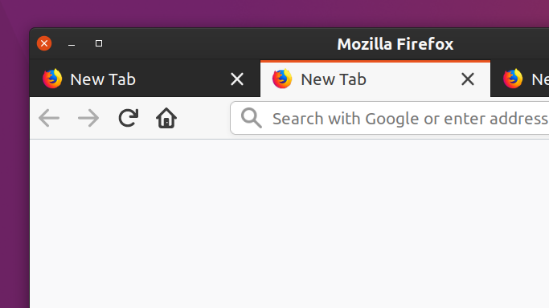
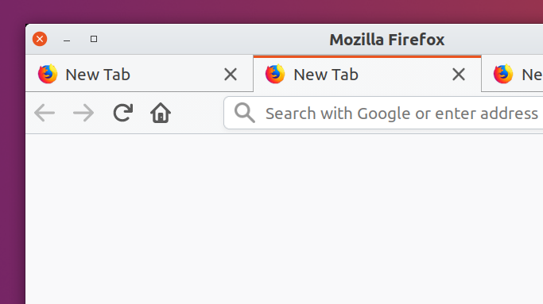
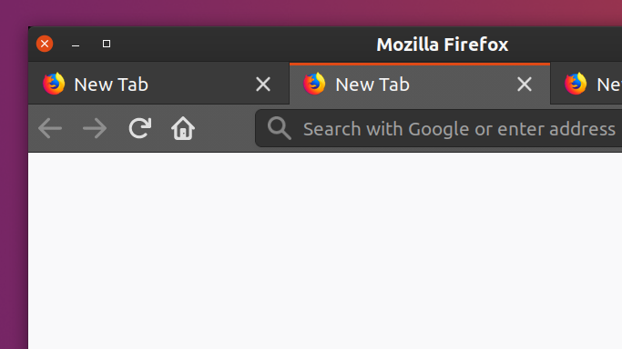
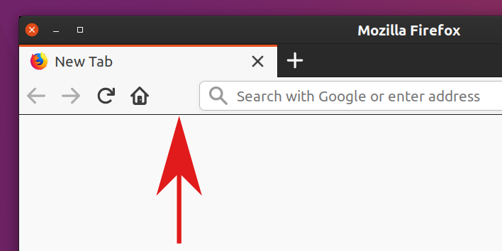

# Ubuntu Yaru based hybrid theme for Firefox

## How to install

https://addons.mozilla.org/firefox/addon/yaru-hybrid/

## Screenshot

  
The active tab and the toolbar has a light color while inactive tabs
have a dark color.

For comparison, here are the default themes
with Yaru (https://github.com/ubuntu/yaru).

* Yaru (light)  
  
* Yaru-dark  
  

## FAQ

### Why not just using Firefox Color?

Firefox Color (https://color.firefox.com/) is great for creating your
own theme, but it doesn't expose all available options for good reason.
Just wanted to specify the color of the border between the toolbar and a
web page not to be too distinct like the following screenshot.

